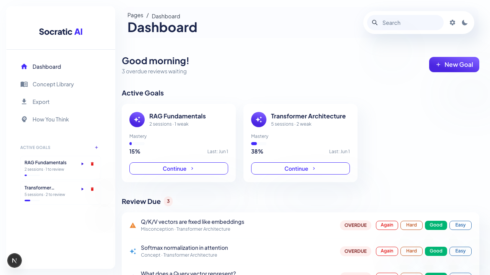
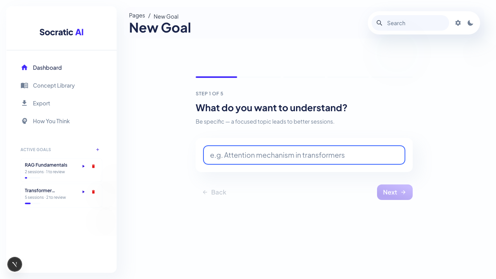
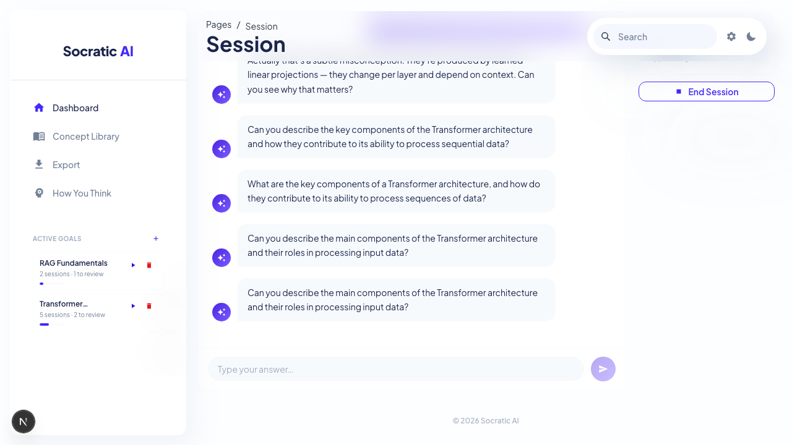
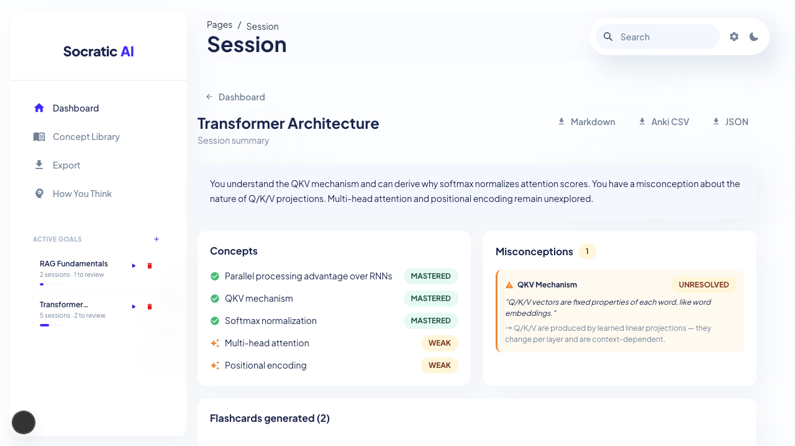
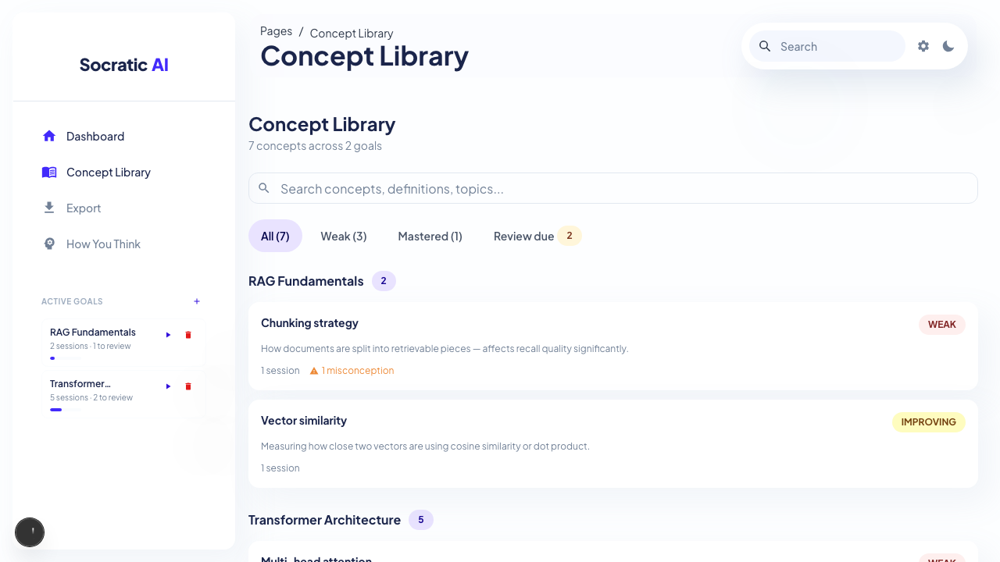
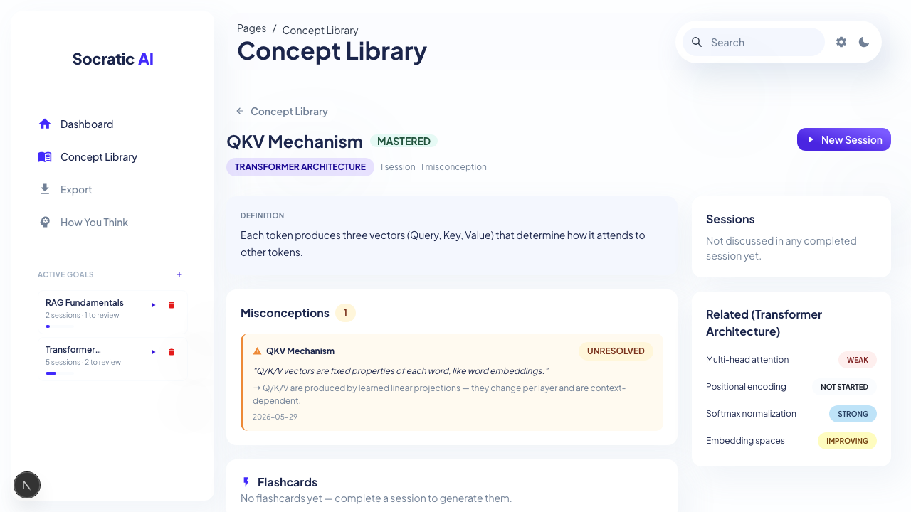
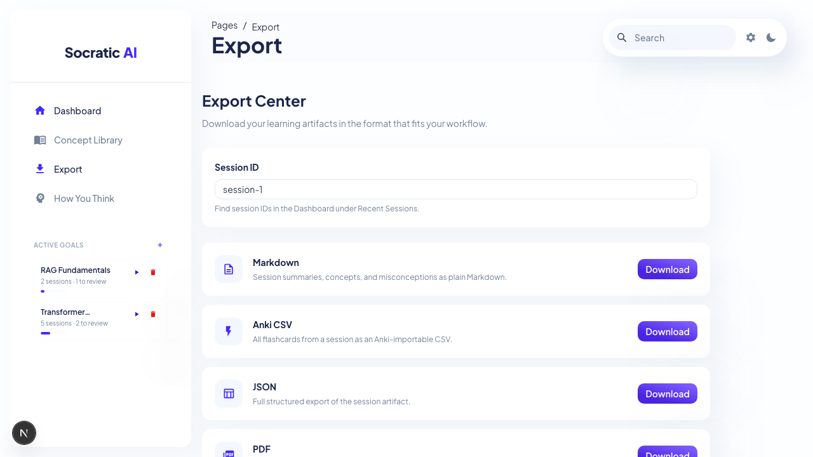

# AI Socratic Learning Studio User Guide

This guide explains how to use the main sections of the webapp. The screenshots use the local seeded demo data, so labels such as `Transformer Architecture`, `RAG Fundamentals`, and `session-1` may differ from a real learner's workspace.

## Before You Start

Run the app locally:

```bash
npm run dev
```

Open the local URL printed by Next.js, usually `http://localhost:3000`. If that port is busy, Next.js will choose another port.

Live tutoring, session summaries, embeddings, and thinking profiles require `OPENAI_API_KEY`. You can set it in `.env`, or use the gear icon in the top-right navbar to open Preferences and save it from the API tab.

The app also includes onboarding in two layers. On the first app open, users are asked to set learning defaults and optionally add an OpenAI API key. After that, route-aware guides introduce each major section the first time the user visits it. Users can reopen the current section guide from the question-mark icon in the top-right navbar.

## Tutorial 1: Use The Dashboard



The Dashboard is the home base for daily learning.

Use **Active Goals** to see each learning path, its mastery percentage, recent activity, and weak concept count. Click **Continue** on a goal to start a new Socratic session for that topic.

Use **Review Due** as the spaced-repetition queue. Each item can be rated:

- **Again** when the idea is still unclear.
- **Hard** when you remembered it with effort.
- **Good** when you understood it normally.
- **Easy** when it felt obvious.

The app uses that rating to schedule the next review. Recent sessions appear below the review queue and link to their generated summaries.

## Tutorial 2: Create A Learning Goal



Click **New Goal** from the Dashboard or the plus button in the sidebar's Active Goals area.

The setup flow has five steps:

1. Enter the topic you want to understand.
2. Choose your current level: beginner, intermediate, or advanced.
3. Choose the target depth: conceptual, applied, or deep.
4. Choose the learning style: intuition first, analogy-heavy, example-driven, or math-friendly.
5. Explain why you are learning the topic.

After the final step, the app creates a learning goal and opens a new Socratic session for it.

## Tutorial 3: Learn In A Socratic Session



The session page is the live tutoring workspace.

Read the tutor's question, type your answer in the input at the bottom, and send it. The tutor responds with another question, a small correction, or a minimal explanation depending on your answer.

On wider screens, the right panel tracks concepts as they emerge. Concepts can be marked as confirmed, learning, or untested. If the tutor detects a misconception, it adds a misconception card with the correction.

Click **End Session** when you are done. Ending a session generates the learning artifact used by the summary page, review queue, flashcards, and exports.

## Tutorial 4: Review A Session Summary



The summary page turns a finished conversation into permanent learning material.

Use the opening summary to quickly remember what happened. The **Concepts** card separates mastered ideas from weak ideas. The **Misconceptions** card records incorrect assumptions and the correction the tutor gave.

The lower sections contain generated flashcards, suggested next questions, and a suggested next topic. The top-right export buttons download the artifact as Markdown, Anki CSV, or JSON.

## Tutorial 5: Manage The Concept Library



The Concept Library is the permanent knowledge system behind the chat.

Use the search bar to find concepts by name, definition, or goal topic. Use the tabs to filter by:

- **All** for every concept.
- **Weak** for concepts that need more practice.
- **Mastered** for strong concepts.
- **Review due** for concepts with unresolved misconceptions.

Concept cards show the definition, session count, mastery status, prerequisites, and misconception count. Click a concept to open its detail page.

## Tutorial 6: Inspect A Concept Detail



The concept detail page focuses on one idea.

Use the definition card as the current working explanation. Use **Misconceptions** to revisit mistakes tied to this concept. Use **Flashcards** to review generated question-answer pairs when available.

The right sidebar shows related concepts from the same goal and can start a new session for the concept's goal with **New Session**.

## Tutorial 7: Export Learning Artifacts



Open **Export** from the sidebar when you want to move learning material into another workflow.

Enter a session ID, then choose a format:

- **Markdown** for notes and summaries.
- **Anki CSV** for importing flashcards into Anki.
- **JSON** for structured data.
- **PDF** for a formatted session report.

The Obsidian and Notion cards are marked as future formats.

## Tutorial 8: Use How You Think

Open **How You Think** from the sidebar to generate a cognitive profile from your learning history. This section summarizes strengths, areas to strengthen, common mistake patterns, and a learning style assessment.

The profile requires at least one generated learning artifact. It also requires `OPENAI_API_KEY`, because the analysis is generated server-side from your goals, concepts, misconceptions, and completed sessions.

## Tutorial 9: Set Preferences

Click the gear icon in the top-right navbar to open Preferences.

Use the **API** tab to save an OpenAI API key locally to `.env` as `OPENAI_API_KEY`. The key is used by server-side routes and is not stored in browser localStorage.

Use the **Learning** tab to set default learning style and target depth. These preferences become defaults for new learning flows.

The first-run onboarding wizard captures these same settings when a new user opens the app for the first time. Preferences remains the place to modify them later.

## Route Reference

| Section | Path | Purpose |
|---|---|---|
| Dashboard | `/` | Goals, due reviews, and recent sessions |
| New Goal | `/goal/new` | Guided five-step goal setup |
| Session | `/session/[id]` | Live Socratic tutoring |
| Session Summary | `/session/[id]/summary` | Generated artifact, flashcards, next steps, and exports |
| Concept Library | `/concepts` | Search and filter the knowledge system |
| Concept Detail | `/concepts/[id]` | Definition, misconceptions, flashcards, related concepts |
| Export Center | `/export` | Download artifacts by session ID |
| How You Think | `/profile` | Generated cognitive profile |

## Troubleshooting

If sessions fail to respond, confirm `OPENAI_API_KEY` is configured.

If the dashboard has no data, call any API route or refresh the app; demo data is seeded automatically on first database access.

If exports return no artifact, end the session first so `/api/sessions/[id]/end` can generate the summary, flashcards, and export data.
